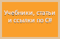
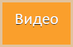
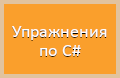
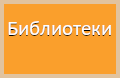

# Учебники, статьи и ссылки по C#

1. Учебники:
	*отсутствуют*
2. Ключевые слова:
	- [Ключевые слова C# 10 (шпаргалка-напоминалка)](csharp-tutorials/ru-ru/csharp-10-keywords/README.md)
3. Статьи с примерами на C#:
	- [Алгоритмы](csharp-articles/ru-ru/algorithms-on-csharp/README.md):
		1. [Кривые Безье](csharp-articles/ru-ru/algorithms-on-csharp/articles/0001-Bezier-curves/README.md)
		2. [Алгоритм нахождения кратчайшего пути в графе (методом грубой силы)](csharp-articles/ru-ru/algorithms-on-csharp/articles/0002-Graphs/README.md)
4. Внешние учебники на русском:
	- [Ключевые слова C#](https://docs.microsoft.com/ru-ru/dotnet/csharp/language-reference/keywords/)
	- [Полное руководство по языку программирования С# 10 и платформе .NET 6](https://metanit.com/sharp/tutorial/)
	- [Руководство по программированию на C#](https://docs.microsoft.com/ru-ru/dotnet/csharp/programming-guide/)
	- [Паттерны проектирования в C# и .NET](https://metanit.com/sharp/patterns/)
	
# Видео

- Алгоритмы:
	1. [Кривые Безье](https://youtu.be/-aaBzgcqQwY)
	
# Упражнения по C#

[Упражнения:](csharp-exercises/ru-ru/README.md)
1. Упражнения для начинающих (постепенное изучение)
	1. [Ввод-вывод в консольных приложениях и циклы](csharp-exercises/ru-ru/001-Input-Output-Cycles/)
	2. (в процессе написания)
2. Решения упражнений пункта 1:
	1. [Ввод-вывод в консольных приложениях и циклы](csharp-exercises/ru-ru/001-Input-Output-Cycles/solution/)
	2. (в процессе написания)
3. [Сложные упражнения, без решения](csharp-exercises/ru-ru/try-open-source/)

# Приложения на C# с открытым исходным кодом (OpenSource)

- Мои:
	- (в процессе написания)
- Сторонние:
	- (в процессе написания)
	
# Обзор библиотек для C#-приложений

(в процессе написания)

# Программа ОГЭ и ЕГЭ по информатике

1. [Программа ОГЭ и ЕГЭ по информатике (в процессе написания)](school-computer-science/ru-ru/school-topics/)
2. (Список экзаменационных вопросов МГТУ им. Н. Э. Баумана по информатике и ИКТ) (в процессе написания)
3. [Методы самообразования и саморазвития (в процессе написания)](school-computer-science/ru-ru/methods-of-self-education-and-self-development/)
4. (в процессе написания)

# Друзья

(в процессе написания)