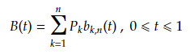
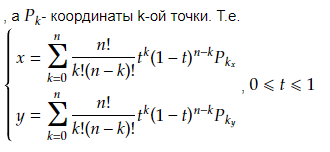

# Алгоритмы - Кривые Безье (в процессе написания)

1. [Введение](#1-введение)
2. [Кривая Безье](#2-кривая-безье)
3. [Геометрическое объяснение кривых Безье Поля де Кастельжо](#3-геометрическое-объяснение-кривых-безье-поля-де-кастельжо)
4. [Уровень дискретизации t](#4-уровень-дискретизации-t)
5. [Заключение](#5-заключение)

## 1. Введение

Кривы́е Безье́ — типы кривых, предложенные в 60-х годах XX века независимо друг от друга Пьером Безье из автомобилестроительной компании «Рено» и Полем де Кастельжо из компании «Ситроен», где применялись для проектирования кузовов автомобилей.

Поле де Кастельжо предложил их геометрическое рекурсивное обоснование. Пьер Безье предложил только их математическую формулировку.

Кривая Безье является частным случаем многочленов Бернштейна, описанных Сергеем Натановичем Бернштейном в 1912 году.

## 2. Кривая Безье

Кривая Безье записывается следующим параметрическим выражением:

## 3. Геометрическое объяснение кривых Безье Поля де Кастельжо

## 4. Уровень дискретизации t

## 5. Заключение
