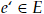
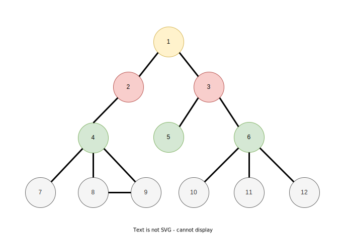
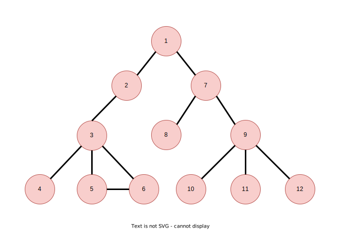
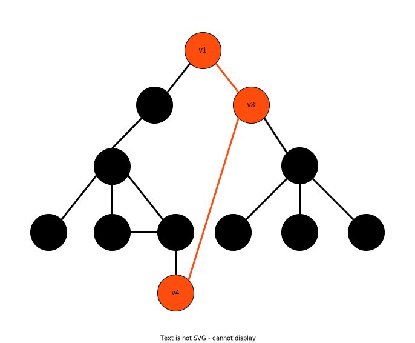

[Главная](https://dmitriysidyakin.github.io/CSharp-Tutorials/) >> [Алгоритмы](https://dmitriysidyakin.github.io/CSharp-Tutorials/csharp-articles/ru-ru/algorithms-on-csharp/)

# Алгоритмы — Алгоритм нахождения кратчайшего пути в графе (методом грубой силы)

1. [Введение](#1-введение)
	1. [Что такое граф?](#11-что-такое-граф)
		1. [Граф](#111-граф)
		2. [Направленный (ориентированный) граф](#112-направленный-ориентированный-граф)
		3. [Взвешенный граф](#113-взвешенный-граф)
		4. [Взвешенно-ориентированный (взвешенно-направленый) граф](#114-взвешенно-ориентированный-взвешенно-направленый-граф)
		5. [Бинарный граф](#115-бинарный-граф)
		6. [Что такое дерево, как структура?](#116-что-такое-дерево-как-структура)
		7. [Сводка](#117-сводка)
2. [Графовые алгоритмы](#2-графовые-алгоритмы)
	1. [Поиск в ширину](#21-поиск-в-ширину)
	2. [Поиск в глубину](#22-поиск-в-глубину)
	3. [Заключение раздела](#23-заключение-раздела)
3. [Алгоритм нахождения кратчайшего пути в графе (методом грубой силы)](#3-алгоритм-нахождения-кратчайшего-пути-в-графе-методом-грубой-силы)
4. [Заключение](#4-заключение)


## 1. Введение

В статье описаны разные типы графов и универсильный способ нахождения кратчайшего пути в этом типе графа метожом грубой силы, т.е. алгоритмы нахождения самого короткого пути в графе между двум точками (вершинами, узлами).

### 1.1. Что такое граф?

#### 1.1.1. Граф

Граф состоит из точек (узлов) *(V, Vertex)* и рёбер *(E, Edge)*, соединяющих вершины. Вот пример графа:


*Рис. 1. Пример графа.*

#### 1.1.2. Направленный (ориентированный) граф

Направленный граф или ориентированный граф имеет помимо структуры обычного графа направление, у ребра соединяющего вершины. У ориентированного графа эти рёбра называются дугами. Он бывает однонаправленный и двунаправленный. Однонаправленным называется граф, содержащий одно направление перехода от одной вершины к другой. Ребра двунаправленного графа содержат одно направление перехода или возможность перехода в обе стороны.

Вот пример однонаправленного графа:


*Рис. 2. Пример однонаправленного графа.*

Далее приведёт пример двунаправленного графа:


*Рис. 3. Пример двунаправленного графа.*

#### 1.1.3. Взвешенный граф

Взвешенны граф - это граф, у которого у рёбер есть вес соединения вершин *W*.


*Рис. 4. Пример взвешенного графа.*

#### 1.1.4. Взвешенно-ориентированный (взвешенно-направленый) граф

Взвешенно-ориентированный (взвешенно-направленый) - это граф, имеющий помимо вершин, рёбер и направлений ещё и вес направленного ребра.

Вот пример однонаправленного взвешенного графа:


*Рис. 5. Пример однонаправленного взвешенного графа.*

Далее приведёт пример двунаправленного взвешенного графа:


*Рис. 6. Пример двунаправленного взвешенного графа.*

#### 1.1.5. Бинарный граф

Бинарный граф - это граф, у которого одна вершина имеет два ребра.

Пример:


*Рис. 7. Пример бинарного графа.*

Он тоже может быть взвешенным, направленным (ориентированным), двунаправленным (ориентированным в обе стороны).

#### 1.1.6. Что такое дерево, как структура?

Дерево - это граф, у которого между двумя любыми узлами есть маршрут и нет циклических связей между ними. Если удалить любой узел дерева, то это нарушит его связанность.

Термины деревьев:

- Корень - входной узел графа.
- Листья  - свисающие окончания графа.
- Ветви - узлы не относящиеся к листьям и корню.

Лес - это множество деревьев.

Пример:


*Рис. 8. Пример дерева.*

Пример графа, не являющегося деревом, с циклическими связями:


*Рис. 9. Граф, не являющейся деревом, с циклическими связями.*

Свойства деревьев:

- Каждое дерево из *n* узлов (вершин) содержит ровно *n - 1* ребро.
- G - ненаправленный (неориентированный) граф c *n* узлами. Если истинны любые два из следующих утверждений, то автоматически выполняется и третье:
	- Граф G является связанным.
	- Граф G не содержит циклов.
	- Граф G содержит *n - 1* ребро.

#### 1.1.7. Сводка

Подытожим описанное ранее и дадим дополнение.

Граф - это математическая модель объектов реальной природы, которые имеют между собой связи. Каждый раф *G* состоит из набора узлов *V (Vertex)* и набора направленных рёбер *E (Edge)*.

Каждое ребро  и представляется упорядоченной парой (*u*, *v*), узел *u* называется начальным, узел *v* - конечным.

Виды графов (рассмотренные ранее):

- обычный;
- направленный (ориентированный) граф;
- взвешенный;
- бинарный;
- дерево.

Виды графов (дополнение):

- циклический (с кольцевыми связями);
- ациклический (без кольцевых связей);
- связанный, когда для любых вершин *u*, *v* есть путь из *u* в *v*.
	
Граф может иметь совмещённые виды, допустим, взвешенно-направленый или бинарное дерево.

Областей применения графов довольно много: в логистике и транспорте, для описания маршрутов; в интернете, для создания индекса цитирования; в социологии/в социальных сетях, для установления связей между людьми и т.д.


# 2. Графовые алгоритмы

Основной задачей работы с графами является обход узлов, связанных рёбрами. Не направленный граф называется *связанным*, если из каждой пары узлов *u* и *v* существует путь из *u* в *v*. Для направленных графов определение даётся по другому: направленный граф называется *сильно связанным*, если для кажой пары узлов *u*, *v* существует путь из *u* в *v*, и путь из *v* в *u*. Для ненаправленных графов, *кратчайший путь* между двумя узлами *e-x* и *e-y* определяется, как минимальное количество ребёр в пути *u-v*. Граф называется *взвешанным*, если для каждого ребра *v* и/или *u* есть вес *w* перехода по этому ребру. *Кратчайшим путём для взвешенного графа* называется путь с минимальной суммой весов *w-i* ребёр в пути *u-v*.

На следующем графе рассмотрим концепции обхода графов:


*Рис. 10. Граф для обхода.*

Далее рассмотрим на этом графе концепцию обхода графа в ширину и глубину. Эти алгоритмы нужны для проверки связанности ненаправленных графов, есть и другие применения.

##  2.1. Поиск в ширину

**Алгоритм поиска в ширину** (англ. breadth-first search, BFS) - позволяет просмотреть все вершины графа.

Рассмотрим последовательность обхода графа:



*Рис. 11. Последовательность обхода поиском в ширину.*

##  2.2. Поиск в глубину

**Алгоритм поиска в глубину** (англ. depth-first search, DFS) - один из методов обхода графа. Стратегия поиска в глубину, как и следует из названия, состоит в том, чтобы идти «вглубь» графа, насколько это возможно.</p>



*Рис. 12. Последовательность обхода поиском в глубину.*

## 	2.3. Заключение раздела

Далее рассматривается алгоритм нахождения кратчайшего пути в графе методом грубой силы.

# 3. Алгоритм нахождения кратчайшего пути в графе (методом грубой силы)

Для начала рассмотрим, что такое кратчайший путь в графе.

Путь строиться путь от начального узла до конечного, что является входными данными (начальный и конечный узел). Кратчайший путь в ызвешенном графе называется путь с наименьшим количеством рёбер от начального узла до конечного.

Рассмотрим пример кратчайшего пути в графе:



*Рис. 13. Кратчайший путь в графе.*

Кратчайшим путём в взвешенном графе является путь с наименьшей суммой весов рёбер.

Рассмотрим пример кратчайшего пути в взвешенном графе:


*Рис. 14. Кратчайший путь в взвешенном графе.*

Кратчайший путь в ориентированном графе - это достижимый путь с наименьшим количеством рёбер.

Кратчайший путь в взвешенном ориетированном графе - это достижимый путь с наименьшей суммой весов рёбер.

Рассмотрим пример кратчайшего пути в взвешенном ориентированном графе:


*Рис. 15. Кратчайший путь в взвешенном ориентированном графе.*

Далее описан алгоритм нахождения кратчайшего пути в графе на основе поиска всех ациклических путей методом грубой силы:

```
function(Список<Узел>, Число) НайтиМинимальныйПуть(
Узел НачальныйУзел,
Число Узел КонечныйУзел
)
{
	Список<(Список<Узел>, Число)> пути = НайтиВсеМаршруты(
			0,
			null,
			Узел НачальныйУзел,
			Узел КонечныйУзел)
	
	return ПутьСМинимальнымВесом(пути);
}

function Список<(Список<Узел>, Число)> НайтиВсеМаршруты(
			Число ВесТекущегоПути,
			Список<Узел> ТекущийПуть,
			Узел НачальныйУзел,
 			Узел КонечныйУзел)
{
	ТекущийПуть.Добавить(НачальныйУзел);

	Список<(Список<Узел>, Число)> aциклическиеПути =
	
	new Список<(Список<Узел>, Число)>;

	Число весТекущегоРузельтата = ВесТекущегоПути;

	if (НачальныйУзел.Id != НачальныйУзел.Id 
		&& НачальныйУзел.КоличествоГраней > 0)
	{
		for (Число i = 0; i < НачальныйУзел.КоличествоГраней; i++)
		{
			var грань = НачальныйУзел.Грани[i];

			// Избежание циклических связей
			if (ТекущийПуть.Contains(грань.To))
			{
				continue;
			}
				
			aциклическиеПути.AddRange(
				НайтиВсеМаршруты(
				весТекущегоРузельтата + грань.Вес /* или 1 в невзвешенном графе */
				, ТекущийПуть.Копия, грань.To, КонечныйУзел)
				); 
		}

		return aциклическиеПути;
	}
	else
	{
		if (КонечныйУзел.Id != НачальныйУзел.Id)
			return aциклическиеПути;

		aциклическиеПути.Add((ТекущийПуть, весТекущегоРузельтата));
		return aциклическиеПути;
	}

}
```

Этим алгоритмом можно искать пути в обычном графе, взвешенном и направленном.

Приведённый метод возвращает все ациклические пути и их вес. Достаточно выбрать путь с наименьшим весом. Этот алгоритм основан на методе с грубой силой (просмотре всех возможных ациклических путей и выбора наименьшего).

Концепция состоит в том, чтобы обойти все возможные ациклические маршруты и сохранить для каждого найденного вес, потом найти минимальный вес:


*Анимация 1. Обход всех путей графа.*

# 4. Заключение

В статье были рассмотрены следующие темы: описание графов, типы графов, введение по графовым алгоритмам, алгоритм нахождения кратчайшего пути в графе. Это послужит точкой входа в Ваши познания о графах.
