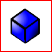

[Главная](https://dmitriysidyakin.github.io/School-IT/) >> [Алгоритмы](https://dmitriysidyakin.github.io/School-IT/csharp-articles/ru-ru/algorithms-on-csharp/)

# 3D-графика на процессоре (Стереометрия в ортогональной проекции)

Сразу хочу сказать, что быстрее работает рендеринг на GPU (видеокарте), эта статья поможет вам ориентироваться лучше в стереометрии.
Программа в статье рендерит картинки на процессоре в простой обёртке кода.

## 1. Введение

Трёх-мерная графика может послужить Вам для моделирования физических процессов, создания реалистичных Трёх-мерных фотографий, создания компьютерных игр и т.п. Отличие её от начертательной геометрии в том, что изображение получается через линзу — есть фокус и горизонт.

Уже есть графические движки импортных производителей, но нет отечественного. Т.к. языковой барьер в рамках биологии не удобен и мешает географическая расположенность, что возможно и для Федеральных округов России, то есть всегда возможность начать использовать свой графический движок.

Эта статья поможет Вам вести не зависимою разработку, хотя и это не обязательно, графического движка для трёх-мерного моделирования.

## 2. Графические примитивы

Графические примитивы очень важны для моделирования физических процессов, в статье рассмотрено самые малые по сложности математические объекты, когда Вы поймёте концепцию, то можно перейти к более сложным приметивам. Поверхности Безье помогут сделать художественное моделирование в играх и реалистичных трёх-мерных фильмах и фотографиях, также они могут быть использованы для физического моделирования с погрешностью и т.п.

### 2.1. Система неравенств куба

*Рис. 1. Куб проецированный при помощи процессора, а не видеокарты, в ортогональной проекции (не в оптической).*

Система неравенств куба длиной стороны два и расположенного в центре:

Система неравенств куба длинной стороны L и расположенного в центре:

### 2.2. Система неравенств прямоугольного параллепипеда

Система неравенств параллепипеда с центром в начале координат и длиннами сторон Lx, Ly, Lz, по осям соответственно:

### 2.3. Система неравенств цилиндра

Система неравенств цилиндра, который находиться в центре координат, и имеет радиус r, и высоту h:

### 2.4. Система неравенств сферы

Система неравенств сферы, который находиться в центре координат и имеет радиус r:

### 2.5. Поверхность Безье

*Рис. 2. Поверхность Безье проецированная при помощи процессора, а не видеокарты, в ортогональной проекции (не в оптической).*

Поверхности Безье — это поверхность замкнутая кривыми Безье и интерполируемая ими же. Вспомним многочлен Безье из статьи [кривые Безье](../0001-Bezier-curves/):

Но здесь многочлен повторяется по всем трём осям и является кривой в пространстве:

* замечание: Pki — в многочленах Bi, выбранные соответствующие значения для оси координаты точки (кортежа).

Многочлен Безье в любом Базисе это Кривая Безье (поверхность).

#### 2.5.1. Полигоны Безье

Полигоны — это такие поверхности Безье, которые замкнуты кривыми Безье первого порядка (линейными кривыми Безье). Из них составляются сложные фигуры. Кстати, полигоны - это не обязательно многочлены Безье, это также и прямые поверности замкнутые прямыми или кривыми (это могут быть просто наклонённые многоугольники или плоские поверхности замкнутые, допустим, функциями).

#### 2.5.2. Кривые поверхности

Кривые — это поверхности, которые замкнуты, как минимум, квадратичной кривой Безье в сочетании с линейными кривыми Безье, или сочетания более высокого порядка. Из них составляются сложные фигуры. Также чаще используются поверхности, которые замкнуты функциями (падаболами, гиперболами и т.п).

### 2.6. Классические полигоны

Это просто прямые поверхности замкнутые в нескольких точках.

### 2.7. Функциональные поверхности

Это просто поверхности заданные точками, через которые проходят функции.

### 2.8. Другие примитивы и части поверхностей, заключение

Существуют и другие примитивы, и фигуры, и полигоны для образования художественных элементов и сложных фигур, как составных, так не составных, просто запишите их в виде системы уравнений или других математик.

В заключение 2-го раздела могу сказать — научитесь представлять объекты в виде систем уравнений (они могут быть такие:  или тоже: ). Советую изучить все виды математик (купить учебники в местном книжном, на ярмарке книг, в интернет магазине или изучить в местном университете).

## 3. Проекция

### 3.1. Ортогональная проекция

Классическая проекция для чертежей в начертательной геомитрии и планеметрии. Проекция отличается тем, что лучи на матрицу приёмник падают по прямой линии, все пердипекулярно камере.

### 3.2. Проекция через линзу

Проецирование происходит не по законам начертательно геометрии, а геометрии и оптики, т.к. так безопаснее для психики.

Далее опишем проецирование через линзу (учитывая, что все объекты заданы с помощью геометрии).

Опишем рисунок:

Снала свет поступает от горы, который отражается от неё (свет, который поступил от источника света, в данном случае от Солнца), далее линейно распространяется до линзы, заранее проходя через точку фокусировки, доходит до точки следующей фокусировки и попадает после на квадратную матрицу, вырезающую часть круга, образованного линзой, в цирвом фотоаппарате это матрица фоторезисторов.

Можно, на компьютере, поставить матрицу (таблицу точек(квадратов)) до первой точки фокусировки, это не мозможно сделать на фоотоаппарате — мешает байонет, т.к. это реальные передаточные механизмы (что-то комбинируемо, что-то нет — главное получить компановку всех возможных вариантов).

## 4. Программа для получения изображений в статье

В данном разделе приведена программа для получения рисунков куба и поверхностей Безье. Программа написана на C# WPF и использует рисование на двух-мерном холсте.

В заключение раздела предоставляю исходный код программы для рисования рисунков куба и поверхности Безье: [Программа для рисования графических примитивов](https://github.com/DmitriySidyakin/Blog-ComputerGraphics/tree/master/3DSamles). Программа написана на C# WPF, программа генерирует картинки попиксельно на холсте пикселей. Программа записывает картинки в корень расположения исполняемого файла. Программа испукает лучи равных 1 точке по ширине из каждого пикселя двухмерного массива точек. Второй способ испускание кадра с тем же самым количеством квадратов, что и в матрице фокусировки (через линзу) не готов, допишите его сами или, лучше, изучити фреймворки для 3D-графики. Программа предназначена для получения этих двух картинок, но Вы можете развить её. Очень примичательно то, что программа программа отображает все графические примитивы и функциональные поверхности, и многое другое, но требует титаническое время для этого, но вы можете распарралелить её.

## 5. Фреймфорки и приложения для трёх-мерной графики

В данном разделе рассматриваются графические редакторы и библиотеки для программирования трёх-мерной графики.

### 5.1. 3ds Max

Мощный инструмент для 3D-моделирования и самый долго присутствующий на рынке, платный.

3ds Max предоставляет обширный гибкий инструментарий для создания первоклассных проектов с полным контролем художественного замысла.

- Создание масштабных миров в компьютерных играх
- Визуализация высококачественных архитектурных проектов
- Моделирование интерьеров и объектов с высокой степенью детализации
- Оживление персонажей и объектов с помощью анимации и визуальных эффектов

### 5.2. Maya

3D-редактор аналогичный 3ds Max.

Создание безграничных миров, сложных персонажей в Maya.

- Создание реалистичных персонажей при помощи увлекательных инструментов анимации.
- Придание формы 3D-объектам и сценам с помощью интуитивных инструментов моделирования в Maya®.
- Создание реалистичных эффектов, моделируя все, что угодно, от взрывов до тканей.

### 5.3. AutoCAD

Приложение для чертежей и создания по ним трёх-мерных объектов.

AutoCAD — это программное обеспечение автоматизированного проектирования (САПР), с помощью которого архитекторы, инженеры и строители создают точные 2D- и 3D-чертежи.

- Разработка, проектирование и аннотирование 2D-геометрии и 3D-моделей с помощью тел, поверхностей и объектов-сеток
- Автоматизация таких задач, как сравнение чертежей, добавление блоков, создание спецификаций и т. д.
- Адаптация с помощью надстроек и API

### 5.4. Blender

Самый мощный бесплатный редактор для 3D-графики.

Blender - это бесплатный пакет для создания 3D-изображений с открытым исходным кодом. Он поддерживает весь конвейер 3D - моделирование, оснастку, анимацию, симуляцию, рендеринг, композицию и отслеживание движения, редактирование видео и конвейер 2D-анимации.

### 5.5. OpenGL

Низкоуровневая библиотека для Windows и Linux для трёх-мерной графики.

OpenGL — это лучшая среда для разработки портативных интерактивных приложений с 2D- и 3D-графикой. С момента своего появления в 1992 году OpenGL стал наиболее широко используемым и поддерживаемым в отрасли интерфейсом программирования приложений (API) 2D и 3D графики, в результате чего тысячи приложений доступны для самых разных компьютерных платформ. OpenGL способствует инновациям и ускоряет разработку приложений за счет включения широкого набора функций визуализации, наложения текстур, специальных эффектов и других мощных функций визуализации. Разработчики могут использовать возможности OpenGL на всех популярных платформах настольных компьютеров и рабочих станций, обеспечивая широкое развертывание приложений.

### 5.6. DirectX

Библиотека для трёх-мерной графики с низкоуровневым API для Windows.

DirectX (от англ. direct — прямой, непосредственный, произносится как «ДайректЭкс») — это набор API, разработанных для решения задач, связанных с программированием под Microsoft Windows. Наиболее широко используется при написании компьютерных игр.

### 5.7. UnrealEngine

Unreal Engine — это самый открытый и продвинутый инструмент для создания 3D в реальном времени. Постоянно развиваясь, чтобы служить не только своей первоначальной цели в качестве современного игрового движка, сегодня он дает создателям из разных отраслей свободу и контроль для предоставления передового контента, интерактивного опыта и иммерсивных виртуальных миров.

### 5.8. Unity3D

Unity3D — это мощный кроссплатформенный 3D-движок и удобная среда разработки. Достаточно простой для новичка и достаточно мощный для эксперта; Unity должна заинтересовать всех, кто хочет легко создавать 3D-игры и приложения для мобильных устройств, настольных компьютеров, Интернета и консолей.

## 6. Заключение

Уравнения геометрических фигур приведены на вскидку, в длине допускаяется наличие длины в точках +1, т.к. ещё включается точка с координатами (0, 0, 0).

В заключение могу пожелать Вам написание собственного трёхмерного интерфейса программирования программы, сейчас есть только DirectX и OpenGL, или ответвлений от них, или перейти к программированию компьютерных игр, и т.п..